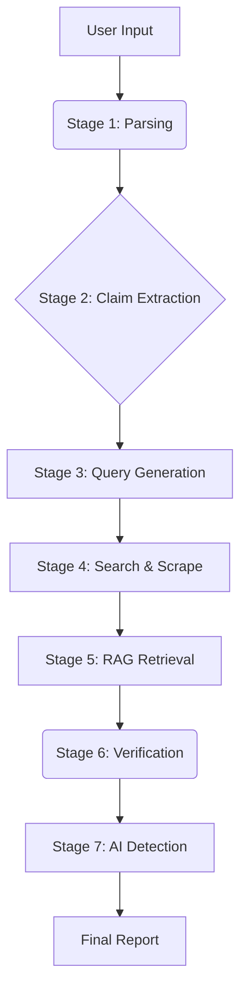

# 🛡️ FactCheck Engine

### **Every Claim. Verified.**

An AI-driven fact-checking engine designed to combat misinformation and LLM hallucinations. This system validates text integrity against real-time web data using a sophisticated multi-stage pipeline, Retrieval-Augmented Generation (RAG), and adaptive web scraping.


---

## 📖 Table of Contents
- [Problem Statement](#-problem-statement)
- [Key Features](#-key-features)
- [Tech Stack](#-tech-stack)
- [Architecture](#-architecture)
- [Installation](#-installation)
- [Configuration](#-configuration)
- [Usage](#-usage)
- [Evaluation Criteria Alignment](#-evaluation-criteria-alignment)
- [Future Roadmap](#-future-roadmap)

---

## 🎯 Problem Statement
The rapid proliferation of AI-generated content has led to a surge in misinformation. Manually fact-checking dense documents is unscalable. This engine automates the verification process by decomposing text into atomic claims, retrieving real-world evidence, and generating verifiable verdicts with confidence scores.

---

## ✨ Key Features

### 1. Multi-Stage Verification Pipeline
A transparent 7-stage pipeline that provides real-time feedback to the user:
1.  **Source Authentication:** Parses Input (Text/URL/PDF).
2.  **Linguistic Pattern Matching:** Extracts atomic, verifiable claims using LLMs.
3.  **Cross-Reference Synthesis:** Generates targeted search queries for each claim.
4.  **Claim Verification:** Gathers evidence from the web.
5.  **Conflict Resolution:** Uses RAG and LLM logic to determine verdicts.
6.  **Report Assembly:** Aggregates data and computes trust scores.
7.  **AI Content Detection:** Analyzes text for AI-generated probability.

### 2. RAG (Retrieval-Augmented Generation)
We utilize **FAISS** vector search and **SentenceTransformers** embeddings to semantically match claims against evidence. This ensures the LLM focuses only on the most relevant paragraphs, significantly increasing accuracy and reducing hallucinations.

### 3. Adaptive Scraping Waterfall
To ensure robust evidence retrieval, the system uses a tiered scraping approach:
- **Tier 1:** `BeautifulSoup4` (Fast, static pages).
- **Tier 2:** `Selenium` (JavaScript-heavy pages).
- **Tier 3:** `Playwright` (Modern SPAs).
- **Tier 4:** `Scrapling` (Adaptive, anti-bot resistant).

### 4. Advanced Prompt Engineering
- **Chain-of-Thought (CoT):** Forces the LLM to reason step-by-step.
- **Self-Reflection:** The LLM audits its own verdicts to prevent hallucinations.
- **Domain Credibility Scoring:** Sources are weighted by trust tiers (Gov/Edu vs. Social Media).

---

## 🛠 Tech Stack

| Layer | Technology |
| :--- | :--- |
| **Frontend** | Streamlit (MVP), Plotly, Custom CSS |
| **Backend** | Python, FastAPI (Production-ready) |
| **LLM & AI** | OpenRouter (Llama 3.3 70B), LangChain, SentenceTransformers |
| **Vector Store** | FAISS (Facebook AI Similarity Search) |
| **Scraping** | BS4, Selenium, Playwright, Scrapling |
| **Database** | JSON (Local MVP), Supabase/PostgreSQL (Production) |

---

## 🏗 Architecture



**Data Flow:**
1. Input is cleaned and processed.
2. LLM extracts atomic claims.
3. Search API finds top URLs; Waterfall Scraper extracts text.
4. Text is split into chunks and vectorized.
5. Top-k chunks mathematically similar to the claim are retrieved.
6. LLM verifies claim against retrieved chunks.

---

## 🚀 Installation

Follow these steps to set up the project locally.

### Prerequisites
- Python 3.9 or higher
- Git

### Steps

1. **Clone the Repository**
   ```bash
   git clone https://github.com/your-username/fact-check-engine.git
   cd fact-check-engine
   ```

2. **Create a Virtual Environment**
   ```bash
   python -m venv venv
   # Windows
   .\venv\Scripts\activate
   # Mac/Linux
   source venv/bin/activate
   ```

3. **Install Dependencies**
   ```bash
   pip install -r requirements.txt
   ```

4. **Install Browser Binaries**
   (Required for Playwright and Scrapling)
   ```bash
   playwright install
   ```

---

## ⚙️ Configuration

Create a `.env` file in the root directory of the project. Copy the contents below and replace the placeholders with your actual keys.

```env
# ===========================================
# LLM Configuration (REQUIRED)
# ===========================================
# Get your key from https://openrouter.ai/
OPENROUTER_API_KEY=sk-or-v1-your-key-here
OPENROUTER_MODEL=meta-llama/llama-3.3-70b-instruct

# ===========================================
# Search Configuration (REQUIRED)
# ===========================================
# 1. Google API Key (from Google Cloud Console)
GOOGLE_CSE_KEY=AIzaSy-your-google-api-key

# 2. Custom Search Engine ID (from Programmable Search Engine)
GOOGLE_CSE_ID=your-search-engine-id

# ===========================================
# Optional Search Providers
# ===========================================
TAVILY_API_KEY=tvly-your-key
SERPAPI_KEY=your-key
```

---

## 💻 Usage

1. **Run the Streamlit App**
   ```bash
   cd frontend
   streamlit run Home.py
   ```

2. **Access the Interface**
   Open your browser and navigate to `http://localhost:8501`.

3. **Run a Fact Check**
   - Paste text, enter a URL, or upload a PDF.
   - (Optional) Adjust Advanced Settings (Depth, Max Claims).
   - Click **VERIFY CLAIMS**.
   - Watch the live pipeline execution and view the detailed report.

---

## 📊 Evaluation Criteria Alignment

| Criteria | Weight | Implementation Strategy |
| :--- | :--- | :--- |
| **Accuracy** | 40% | RAG implementation ensures precise context; Multi-source scraping ensures evidence availability; Self-reflection prompts reduce hallucinations. |
| **Aesthetics** | 30% | "Forensic Intelligence Terminal" dark theme; Live streaming logs; Interactive Plotly charts; Custom CSS cards for claims. |
| **Innovation** | 30% | Waterfall scraping architecture (BS4->Scrapling); Local vector search (FAISS); Domain credibility weighting. |
| **Bonus** | +10 | AI-Generated Text Detection implemented using linguistic features and LLM analysis. |

---

## 📂 Project Structure

```text
fact-check-engine/
│
├── .env                    # API Keys and Config
├── requirements.txt        # Python dependencies
├── README.md               # You are here
│
├── core/                   # Backend Logic Library
│   ├── __init__.py
│   ├── config.py           # Settings loader
│   ├── pipeline.py         # Main orchestrator
│   ├── llm_client.py       # LLM API calls & Prompts
│   ├── rag_engine.py       # Vector search & Chunking
│   ├── scraper.py          # Waterfall scraping logic
│   ├── search_service.py   # Google/DDG search
│   ├── domain_trust.py     # Credibility scoring
│   ├── ai_detector.py      # AI text detection
│   └── storage.py          # Local JSON persistence
│
├── frontend/               # Streamlit App
│   ├── Home.py             # Main Entry Point
│   └── pages/
│       ├── 1_Pipeline.py   # Live Monitor
│       ├── 2_Report.py     # Results Dashboard
│       └── 3_History.py    # Session Archive
│
└── history.json            # Local database (auto-generated)
```

---

## 🔮 Future Roadmap

- [ ] **Media Detection:** Integrate AI image detection (Deepfakes).
- [ ] **Browser Extension:** Right-click to verify any text on a webpage.
- [ ] **Batch Processing:** Upload CSVs of URLs for bulk verification.
- [ ] **Supabase Integration:** Move from local JSON to cloud Postgres.

---

## 📄 License

This project is licensed under the MIT License.

---

<p align="center">
  Built with ❤️ for the AI Hackathon
</p>
